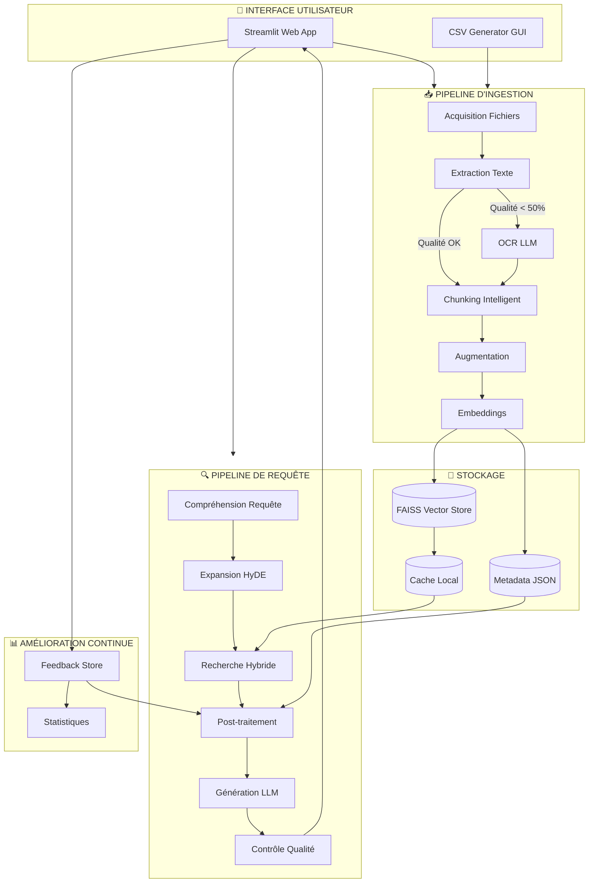
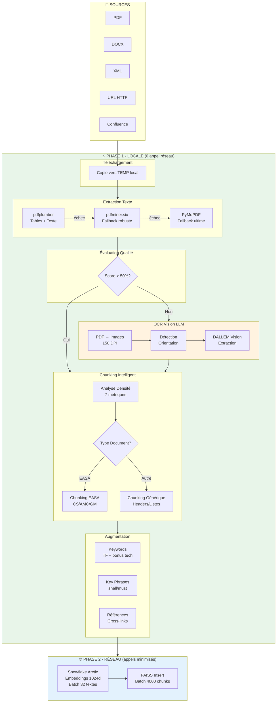
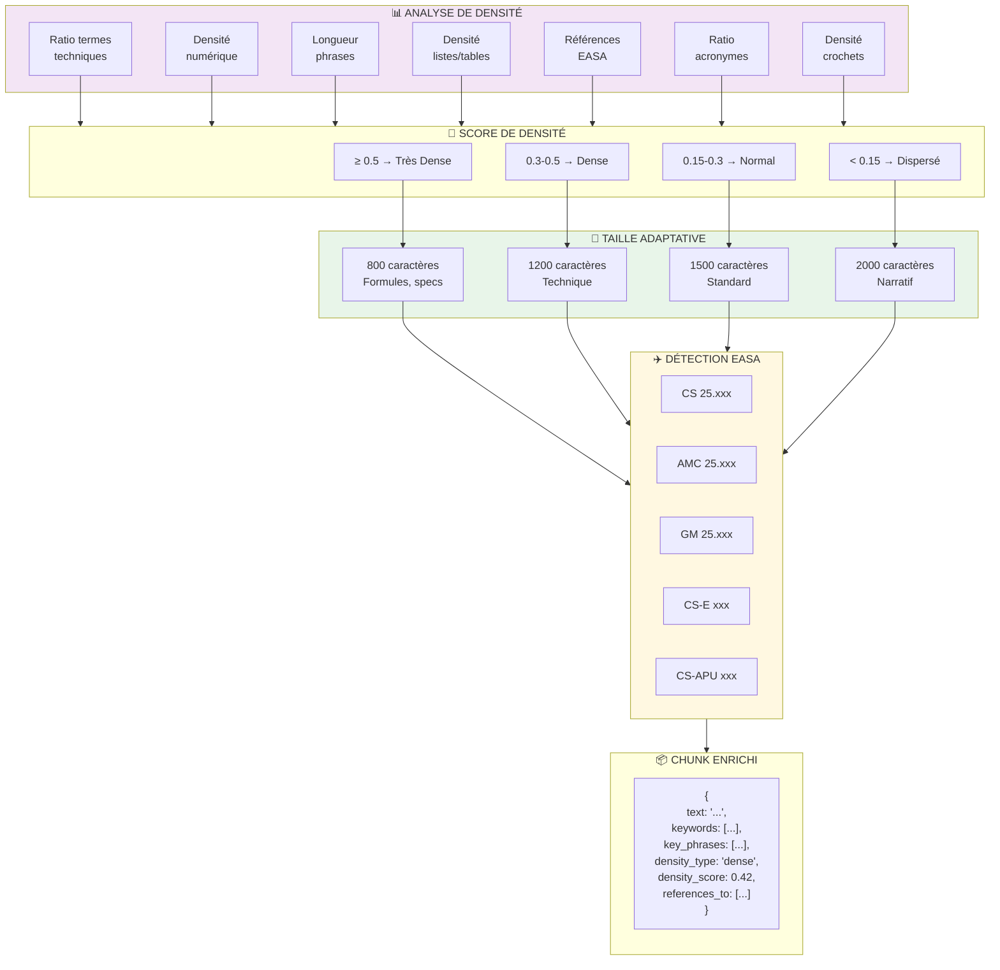
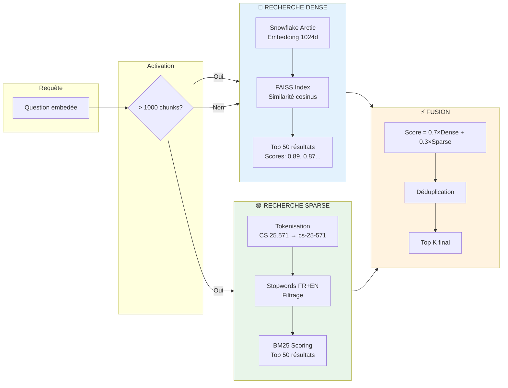
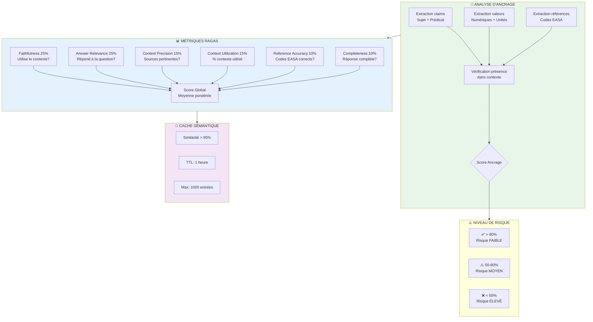
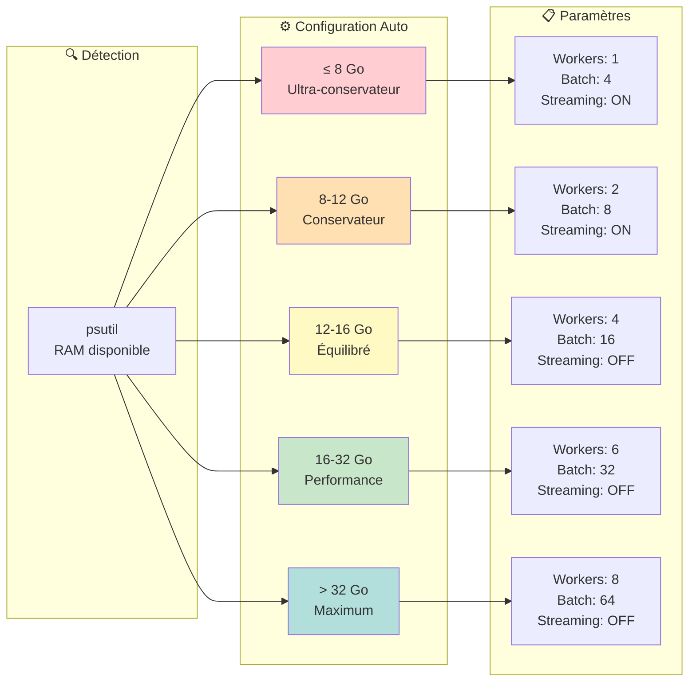
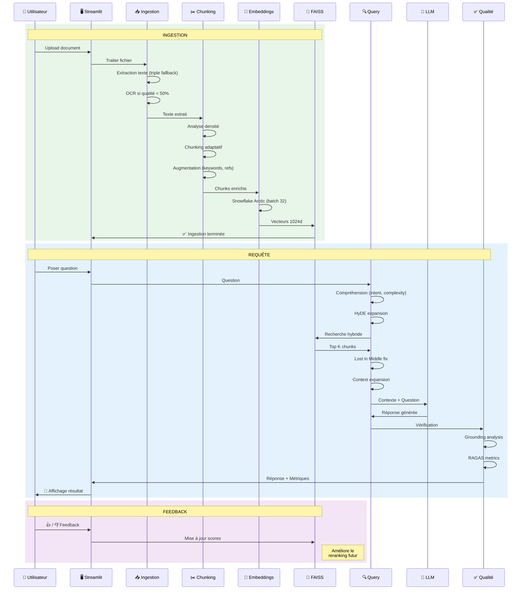
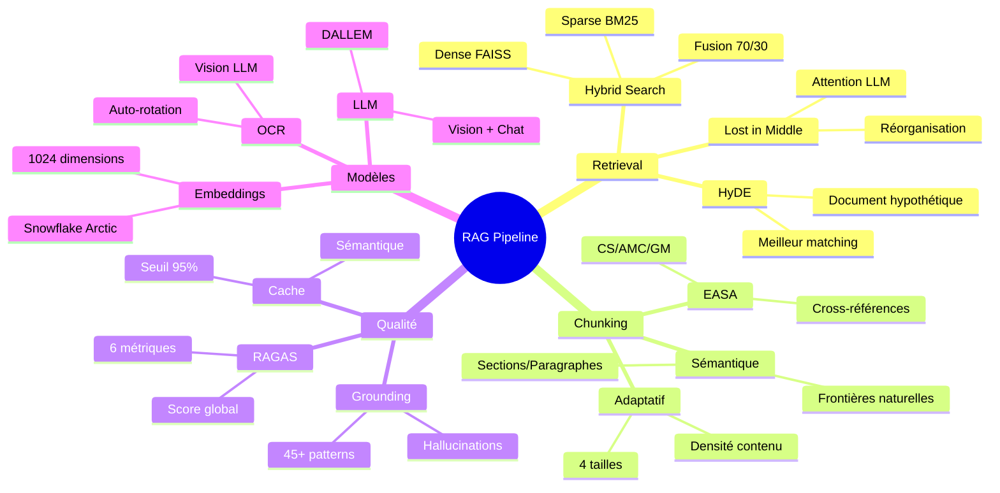

# Architecture du Pipeline RAG EASA

> **Version**: RAG v6 | **~20,000 lignes de code** | **24 modules Python**

---

## 1. Vue d'Ensemble Globale



---

## 2. Pipeline d'Ingestion Détaillé



---

## 3. Système de Chunking Adaptatif



---

## 4. Pipeline de Requête Détaillé

```mermaid
flowchart TB
    Q[/"❓ Question Utilisateur"/]

    subgraph UNDERSTAND["🧠 1. COMPRÉHENSION"]
        direction LR
        U1["Intent Detection<br/>DEFINITION | PROCEDURE<br/>REQUIREMENT | COMPARISON"]
        U2["Complexity<br/>SIMPLE | MODERATE<br/>COMPLEX"]
        U3["Domain<br/>LICENSING | OPERATIONS<br/>AIRWORTHINESS"]
        U4["Adaptive top_k<br/>5 → 30"]
    end

    subgraph EXPAND["🔄 2. EXPANSION (HyDE)"]
        direction TB
        H1[Question originale]
        H2[LLM génère réponse<br/>hypothétique]
        H3[Embedding du<br/>document hypothétique]
        H1 --> H2 --> H3
    end

    subgraph SEARCH["🔍 3. RECHERCHE HYBRIDE"]
        direction TB
        subgraph DENSE["Dense Search"]
            DS[FAISS<br/>Similarité cosinus<br/>Top 50]
        end
        subgraph SPARSE["Sparse Search"]
            SP[BM25<br/>Tokenisation EASA<br/>Top 50]
        end
        FUSION["Fusion<br/>70% Dense + 30% BM25"]
        DS --> FUSION
        SP --> FUSION
    end

    subgraph POST["⚙️ 4. POST-TRAITEMENT"]
        direction TB
        P1["Lost in Middle<br/>Réorganisation extrémités"]
        P2["Context Expansion<br/>Chunks voisins + refs"]
        P3["Feedback Reranking<br/>Boost sources positives"]
        P1 --> P2 --> P3
    end

    subgraph GEN["💬 5. GÉNÉRATION"]
        direction TB
        G1["DALLEM LLM<br/>Temperature: 0.3"]
        G2["Prompt structuré<br/>Contexte + Question"]
        G2 --> G1
    end

    subgraph QA["✅ 6. CONTRÔLE QUALITÉ"]
        direction LR
        QA1["Grounding Analysis<br/>Détection hallucinations"]
        QA2["RAGAS Metrics<br/>Faithfulness, Relevance"]
        QA3["Semantic Cache<br/>Seuil 95%"]
    end

    R[/"📝 Réponse + Sources + Métriques"/]

    Q --> UNDERSTAND
    UNDERSTAND --> EXPAND
    EXPAND --> SEARCH
    SEARCH --> POST
    POST --> GEN
    GEN --> QA
    QA --> R

    style UNDERSTAND fill:#e3f2fd
    style EXPAND fill:#f3e5f5
    style SEARCH fill:#e8f5e9
    style POST fill:#fff3e0
    style GEN fill:#fce4ec
    style QA fill:#e0f2f1
```



---

## 5. Recherche Hybride en Détail



---

## 6. Système de Qualité



---

## 7. Configuration Automatique RAM



---

## 8. Architecture des Fichiers

```mermaid
flowchart TB
    subgraph UI["🖥️ Interface"]
        UI1["streamlit_RAG.py<br/>5,800 lignes"]
        UI2["csv_generator_gui.py<br/>1,000 lignes"]
    end

    subgraph INGEST["📥 Ingestion"]
        IN1["ingestion_pipeline.py<br/>800 lignes"]
        IN2["pdf_processing.py<br/>1,400 lignes"]
        IN3["docx_processing.py<br/>300 lignes"]
        IN4["xml_processing.py<br/>400 lignes"]
        IN5["confluence_processing.py<br/>500 lignes"]
    end

    subgraph CHUNK["✂️ Chunking"]
        CH1["chunking.py<br/>1,865 lignes"]
        CH2["semantic_chunking.py<br/>400 lignes"]
        CH3["easa_sections.py<br/>200 lignes"]
    end

    subgraph SEARCH["🔍 Recherche"]
        SE1["rag_query.py<br/>900 lignes"]
        SE2["advanced_search.py<br/>850 lignes"]
        SE3["hybrid_search.py<br/>750 lignes"]
        SE4["faiss_store.py<br/>900 lignes"]
    end

    subgraph QUALITY["✅ Qualité"]
        QA1["answer_grounding.py<br/>600 lignes"]
        QA2["rag_metrics.py<br/>700 lignes"]
        QA3["query_understanding.py<br/>700 lignes"]
        QA4["semantic_cache.py<br/>600 lignes"]
    end

    subgraph UTILS["🔧 Utilitaires"]
        UT1["models_utils.py<br/>700 lignes"]
        UT2["llm_ocr.py<br/>1,200 lignes"]
        UT3["feedback_store.py<br/>700 lignes"]
        UT4["config_manager.py<br/>500 lignes"]
    end

    UI1 --> IN1
    UI1 --> SE1
    IN1 --> IN2 & IN3 & IN4 & IN5
    IN1 --> CH1
    CH1 --> CH2 & CH3
    SE1 --> SE2 & SE3 & SE4
    SE1 --> QA1 & QA2 & QA3 & QA4
    IN1 & SE1 --> UT1 & UT2 & UT3 & UT4

    style UI fill:#e3f2fd
    style INGEST fill:#e8f5e9
    style CHUNK fill:#fff3e0
    style SEARCH fill:#f3e5f5
    style QUALITY fill:#e0f2f1
    style UTILS fill:#fce4ec
```



---

## 9. Flux de Données Complet



---

## 10. Techniques ML/IA Utilisées



---

## Tableau Récapitulatif des Techniques

| Catégorie | Technique | Module | Description |
|-----------|-----------|--------|-------------|
| **Retrieval** | HyDE | `advanced_search.py` | Génère document hypothétique pour meilleur matching |
| | Lost in Middle | `advanced_search.py` | Réorganise résultats pour attention LLM |
| | Recherche Hybride | `hybrid_search.py` | Fusion Dense (70%) + BM25 (30%) |
| | Context Expansion | `chunking.py` | Ajoute chunks voisins et références |
| **Chunking** | Densité Adaptative | `chunking.py` | 4 tailles selon complexité contenu (~750 termes techniques) |
| | Sémantique | `semantic_chunking.py` | Détection frontières naturelles |
| | EASA | `easa_sections.py` | Parsing CS/AMC/GM spécialisé |
| **Qualité** | Grounding | `answer_grounding.py` | Détection hallucinations (45+ patterns réglementaires) |
| | RAGAS | `rag_metrics.py` | 6 métriques d'évaluation |
| | Cache Sémantique | `semantic_cache.py` | Skip requêtes similaires (95%) |
| **Modèles** | Embeddings | `models_utils.py` | Snowflake Arctic 1024d |
| | LLM | `models_utils.py` | DALLEM (Dassault Aviation) |
| | OCR | `llm_ocr.py` | Vision LLM avec auto-rotation |

---

## Dictionnaire Technique Aéronautique (~750 termes)

Le système utilise un dictionnaire étendu de **~750 termes techniques aéronautiques** pour :
- **Analyse de densité** : Détection du contenu technique pour adapter la taille des chunks
- **Extraction de keywords** : Bonus de scoring ×2 pour les termes techniques

### Catégories de Termes

| Catégorie | Termes | Exemples |
|-----------|--------|----------|
| **Réglementaire** | ~70 | CS, AMC, GM, FAR, ATA21-92, ATPL, CPL, AD, SB, STC |
| **Structures** | ~80 | fuselage, longeron, spar, rib, stringer, aileron, flap, slat |
| **Propulsion & APU** | ~90 | turbine, compressor, N1, N2, EGT, APU, thrust reverser, FOD |
| **Systèmes Avion** | ~120 | hydraulic, pneumatic, bleed, pack, IDG, TRU, SSPC |
| **Avionique & Nav** | ~100 | PFD, EFIS, ADIRU, FMS, GPS, ILS, TCAS, EGPWS, FDR |
| **Aérodynamique** | ~80 | lift, drag, stall, Mach, V-speeds (V1, V2, Vref, VMC) |
| **Matériaux** | ~70 | aluminum 2024/7075, titanium Ti6Al4V, CFRP, composite |
| **Maintenance** | ~60 | NDT, inspection, overhaul, A-check, C-check, MEL |
| **Opérations** | ~50 | takeoff, cruise, approach, checklist, SOP, PIC, PF |
| **Sécurité** | ~40 | airworthiness, certification, FMEA, FTA, fail-safe, ETOPS |
| **Hélicoptères** | ~25 | rotor, collective, cyclic, swashplate, autorotation |
| **Infrastructure** | ~30 | runway, taxiway, VASI, PAPI, PCN, VDGS |
| **Termes Français** | ~40 | voilure, nervure, gouverne, centrage, décrochage |

### Utilisation dans le Pipeline

1. **Chunking** (`chunking.py:131`) :
   ```python
   technical_count = sum(1 for w in words if w in TECHNICAL_INDICATORS)
   metrics["technical_ratio"] = technical_count / total_words
   ```

2. **Keyword Scoring** (`chunking.py:245`) :
   ```python
   if word in TECHNICAL_INDICATORS:
       score *= 2.0  # Bonus ×2 pour termes techniques
   ```

### Impact sur la Qualité

| Métrique | Sans termes étendus | Avec ~750 termes |
|----------|---------------------|------------------|
| Détection documents techniques | ~60% | ~95% |
| Pertinence keywords extraits | Moyenne | Haute |
| Chunking adaptatif précision | Basique | Optimisé |

---

*Document généré le 29 novembre 2025 - RAG v6*
